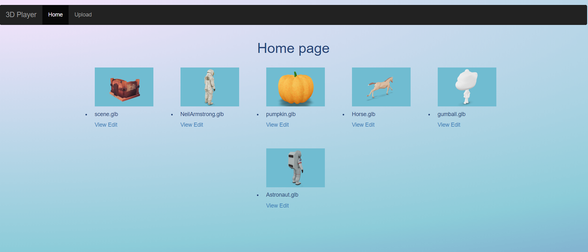
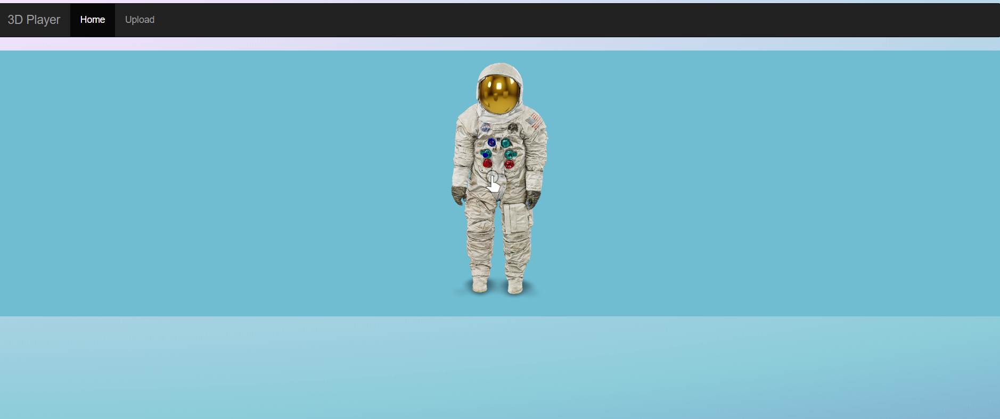
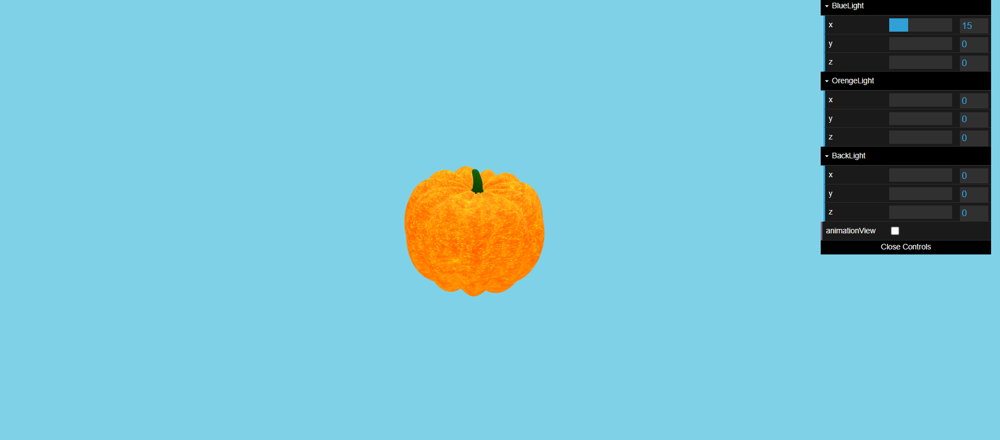
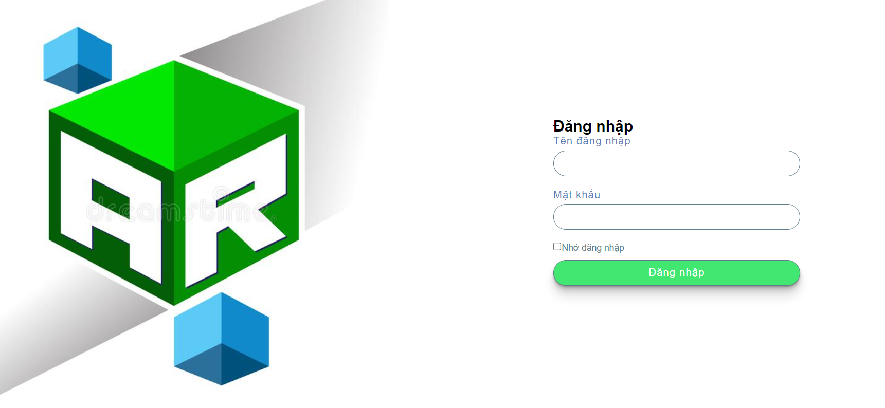
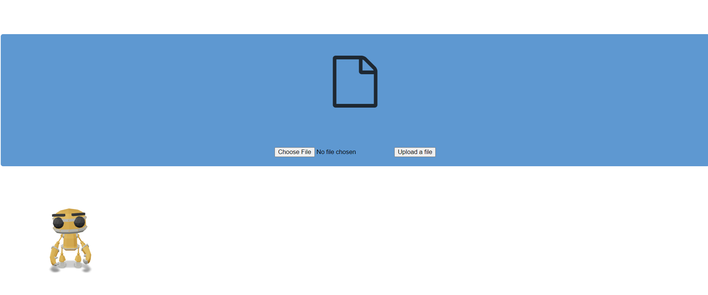

# Đề tài: Tìm hiểu 3D/AR, Google Model-Viewer và Xây dựng web trình diễn 3D

Các thành viên trong nhóm:
- Nguyễn Thị Bích Ngọc
- Nguyễn Hồng Vân
- Đỗ Thùy Linh
## 1. Tìm hiểu 3D/AR và công nghệ web
Đã được trình bày trong file Report

### 1.1 3D/AR
-	3D hay 3-Dimension (3 chiều) là phương pháp tạo ra những hình ảnh sống động như thật với sự trợ giúp của các phần mềm đồ họa vi tính
-	AR hay Augmented Reality (Thực tế Tăng cường) là công nghệ cho phép lồng ghép thông tin ảo vào thế giới thực và ngược lại giúp người sử dụng tương tác với những nội dung số trong thực tế. Có thể trải nghiệm sử dụng ngày với thiết bị smartphone mà không cần sử dụng các công cụ khác.

### 1.2 Công nghệ Web
- Sử dụng NodeJS cho BackEnd và sử dụng HTML, CSS cho FrontEnd
- Bên cạnh đó dùng Database MySQL cho việc lưu trữ account quản trị viên và danh sách các model 
- Sử dụng thư viện Three.js hỗ trợ làm 3D bằng các phương thức như WebGL, Canvas hay SVG
## 2. Xây dựng web trình diễn 3D
- Ý tưởng xây dựng hệ thống 3D: Có biểu tượng các model hiện lên để chọn và khi click vào model đó sẽ được trình diễn 
- Mô tả hệ thống web trình diễn 3D: Web 3D cho phép người dùng xem ảnh 3D. Quản trị viên sẽ có quyền up file 3D lên trang web để người dùng có thể nhìn thấy
### 2.1 Trình diễn model 3D
Web 3D cho phép người dùng xem ảnh 3D. Dưới mỗi model sẽ có nút View và nút Edit. Click vào nút View để xem các model và click vào nút Edit để chỉnh độ sáng, thêm màu sắc,...

View

Edit: 

### 2.2 Đăng nhập cho quản trị viên
Sử dụng Database MySQL để lưu trữ thông tin account (user, password) của quản trị viên.

### 2.3 Quản trị viên có quyền tải lên file model 3D
Sau khi đăng nhập thành công, quản trị viên có thể tải lên file model 3D và chỉ có thể tải file định dạng .glb
Login

Upload

